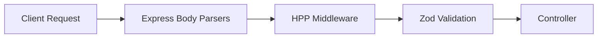

# Architecture Patterns: Hardening & DX

**Domain:** Production Hardening & Developer Experience
**Researched:** 2025-05-14
**Overall Confidence:** HIGH

## Recommended Architecture

### Error Monitoring (Sentry)

The integration follows a "Zero-Day initialization" pattern, ensuring error capture starts before the application logic.

| Layer | Entry Point | Responsibility |
|-------|-------------|----------------|
| **Frontend** | `instrumentation.ts` | Captures Server Components, Server Actions, and Middleware errors. |
| **Frontend** | `sentry.client.config.ts` | Captures browser-side React 19 errors and Session Replays. |
| **Backend** | `instrument.ts` | OpenTelemetry-based initialization for the Express 5 process. |

### Data Flow for API Security

HPP protection is implemented as a global barrier before request reach the controllers.



## Patterns to Follow

### Pattern 1: Immutability-Safe Query Handling (Express 5)
**What:** Treat `req.query` as read-only and use Zod to create a new, safe object.
**When:** All GET routes with query parameters.
**Example:**
```typescript
const querySchema = z.object({ id: z.string() });
app.get('/api/data', (req, res) => {
  const result = querySchema.safeParse(req.query);
  if (!result.success) return res.status(400).send(result.error);
  const { id } = result.data; // Use this, NOT req.query.id
});
```

### Pattern 2: Conventional Branching & Commits
**What:** Enforce commit messages via Husky + Commitlint and align them with branch naming.
**Pattern:** `type/description` (e.g., `feat/sentry-integration`).

## Anti-Patterns to Avoid

### Anti-Pattern 1: Manual Error Logging
**What:** Using `console.error` without reporting to Sentry.
**Why bad:** Errors are lost once the console buffer clears; no alerting or grouping.
**Instead:** Use `Sentry.captureException(error)`.

### Anti-Pattern 2: Nested Query Parameters
**What:** Using `?user[id]=1&user[name]=admin`.
**Why bad:** Complex to parse and vulnerable to prototype pollution. Express 5 defaults to `simple` parser which ignores these.
**Instead:** Use flat parameters `?user_id=1&user_name=admin`.

## Scalability Considerations

| Concern | Status | Mitigation |
|---------|--------|------------|
| Sentry Quotas | 100+ errors/day | Use `tracesSampleRate: 0.1` and `beforeSend` filtering. |
| DBML Drift | Every migration | Add `npx prisma generate` to the CI/CD pipeline. |

## Sources

- [Next.js Instrumentation Hook](https://nextjs.org/docs/app/building-your-application/optimizing/instrumentation)
- [Sentry Express 5 Guide](https://docs.sentry.io/platforms/javascript/guides/express/)
