# VP-Planilla DB

> Generated by [`prisma-markdown`](https://github.com/samchon/prisma-markdown)

- [default](#default)

## default

```mermaid
erDiagram
"vpg_audit_logs" {
  Int audit_logs_id PK
  Int audit_logs_user_id FK
  String(100) audit_logs_action
  String(100) audit_logs_entity
  Int audit_logs_entity_id
  DateTime(6) audit_logs_timestamp
  String audit_logs_details "nullable"
}
"vpg_bonuses" {
  Int bonuses_id PK
  Int bonuses_employee_id FK
  Int bonuses_payroll_id FK
  Int bonuses_year
  Int bonuses_month
  String(255) bonuses_description
  Decimal(10) bonuses_amount
  DateTime bonuses_granted_at
  Int bonuses_version
}
"vpg_branches" {
  Int branch_id PK
  String(50) branch_name
  String(100) branch_location
  Int branch_version
}
"vpg_clock_logs" {
  Int clock_logs_id PK
  Int clock_logs_employee_id FK
  DateTime(6) clock_logs_timestamp
  ClockLogType clock_logs_log_type
  String clock_logs_remarks "nullable"
  ClockLogStatus clock_logs_status
  ClockLogSource clock_logs_source
  Int clock_logs_version
  Int clock_logs_import_session_id FK "nullable"
}
"vpg_clock_log_adjustments" {
  Int adjustment_id PK
  Int adjustment_clock_log_id FK "nullable"
  Int adjustment_employee_id FK
  ClockLogAdjustmentType adjustment_type
  DateTime(6) adjustment_original_timestamp "nullable"
  DateTime(6) adjustment_new_timestamp "nullable"
  ClockLogType adjustment_log_type
  String adjustment_justification
  ClockLogAdjustmentStatus adjustment_status
  Int adjustment_created_by FK
  DateTime(6) adjustment_created_at
  Int adjustment_version
}
"vpg_clock_aliases" {
  Int aliases_id PK
  Int aliases_employee_id FK
  String(100) aliases_name
  DateTime(6) aliases_created_at
  Int aliases_version
}
"vpg_clock_import_sessions" {
  Int import_sessions_id PK
  DateTime(6) import_sessions_started_at
  DateTime(6) import_sessions_completed_at "nullable"
  ClockLogSource import_sessions_source
  String(20) import_sessions_status
  Int import_sessions_total_records
  Int import_sessions_created_count
  Int import_sessions_skipped_count
  Int import_sessions_anomaly_count
  Int import_sessions_created_by FK
}
"vpg_deductions" {
  Int deductions_id PK
  String(100) deductions_name
  String deductions_description
  Decimal(5) deductions_percentage "nullable"
  Decimal(10) deductions_fixed_amount "nullable"
  Int deductions_version
}
"vpg_employee_documents" {
  Int employee_documents_id PK
  Int employee_documents_employee_id FK
  String(255) employee_documents_file_path
  String(50) employee_documents_document_type
  DateTime(6) employee_documents_uploaded_at
}
"vpg_employee_labor_event" {
  Int employee_labor_event_id PK
  Int employee_labor_event_employee_id FK
  Int employee_labor_event_labor_event_id FK
  DateTime employee_labor_event_start_date
  DateTime employee_labor_event_end_date "nullable"
  String(20) employee_labor_event_status
  Int employee_labor_event_version
}
"vpg_employees" {
  Int employee_id PK
  String(50) employee_first_name
  String(50) employee_last_name
  String(50) employee_middle_name
  String(30) employee_national_id
  String(100) employee_social_code
  String(100) employee_email
  Int employee_position_id FK
  DateTime employee_hire_date
  DateTime employee_exit_date "nullable"
  Boolean employee_fired
  String(1) employee_status
  Decimal(5) employee_required_hours_biweekly "nullable"
  String(20) employee_gender "nullable"
  String(20) employee_phone "nullable"
  EmployeeShiftType employee_shift_type
  Int employee_version
}
"vpg_enterprise" {
  Int enterprise_id PK
  String(50) enterprise_name
  Bytes enterprise_image
  DateTime enterprise_creation_date
  Int enterprise_version
  MinuteRoundingPolicy enterprise_minute_rounding_policy
  Boolean enterprise_rounding_policy_acknowledged
  Boolean enterprise_is_commercial_activity
  ShiftType enterprise_ordinary_shift_type
  Boolean enterprise_pay_unworked_holidays
  Int enterprise_aguinaldo_period_start_month
  Int enterprise_aguinaldo_period_start_day
  Int enterprise_aguinaldo_payment_deadline_day
}
"vpg_labor_events" {
  Int labor_events_id PK
  String(100) labor_events_name
  String labor_events_description
  Int labor_events_version
  LaborEventPayBehavior labor_event_pay_behavior
  Int labor_event_max_paid_days "nullable"
  Decimal(5) labor_event_pay_percentage "nullable"
}
"vpg_mail_server_settings" {
  Int mail_server_settings_id PK
  String(100) mail_server_settings_host
  Int mail_server_settings_port
  String(100) mail_server_settings_username
  String(255) mail_server_settings_password
  String(100) mail_server_settings_from_address
  Boolean mail_server_settings_use_ssl
  Boolean mail_server_settings_use_tls
  Int mail_server_settings_version
}
"vpg_payroll_employee" {
  Int payroll_employee_id PK
  Int payroll_employee_payroll_id FK
  Int payroll_employee_employee_id FK
  Decimal(10) payroll_employee_total_hours "nullable"
  Decimal(10) payroll_employee_overtime_hours "nullable"
  Decimal(10) payroll_employee_overtime_pay "nullable"
  Decimal(10) payroll_employee_weekly_rest_hours "nullable"
  Decimal(10) payroll_employee_weekly_rest_pay "nullable"
  Decimal(10) payroll_employee_bonuses "nullable"
  Decimal(10) payroll_employee_gross_salary
  Decimal(10) payroll_employee_total_deductions
  Decimal(10) payroll_employee_net_salary
  Int payroll_employee_worked_days
  Int payroll_employee_version
  Decimal(10) payroll_employee_hours_override "nullable"
  Decimal(10) payroll_employee_overtime_override "nullable"
  Decimal(10) payroll_employee_weekly_rest_override "nullable"
  Decimal(10) payroll_employee_deductions_override "nullable"
  Boolean payroll_employee_is_manually_adjusted
}
"vpg_payroll_types" {
  Int payroll_types_id PK
  String(50) payroll_types_name
  String payroll_types_description
  Int payroll_types_version
}
"vpg_payrolls" {
  Int payrolls_id PK
  Int payrolls_payroll_type_id FK
  DateTime payrolls_period_start
  DateTime payrolls_period_end
  DateTime payrolls_payment_date
  PayrollStatus payrolls_status
  String(20) payrolls_period_type
  Int payrolls_approved_by FK "nullable"
  DateTime(6) payrolls_approved_at "nullable"
  String payrolls_notes "nullable"
  DateTime(6) payrolls_reopened_at "nullable"
  String payrolls_reopen_reason "nullable"
  Int payrolls_version
}
"vpg_payroll_param_snapshots" {
  String id PK
  Int payroll_id FK
  String param_key
  String param_value
  DateTime param_valid_from
  String source_decree "nullable"
  DateTime captured_at
}
"vpg_payroll_recalculations" {
  Int recalc_id PK
  Int recalc_payroll_id FK
  String recalc_reason
  DateTime(6) recalc_timestamp
  Int recalc_created_by FK
  Json recalc_data_snapshot
}
"vpg_positions" {
  Int position_id PK
  String(50) position_name
  String position_description
  Decimal(10) position_base_salary
  String(20) position_occupation_code "nullable"
  String(10) position_risk_class "nullable"
  Int position_version
}
"vpg_report_logs" {
  Int report_logs_id PK
  String(50) report_logs_report_type
  Int report_logs_generated_by FK
  DateTime(6) report_logs_generated_at
  DateTime report_logs_period_start
  DateTime report_logs_period_end
  String(255) report_logs_file_path
  String(20) report_logs_status
  Int report_logs_version
}
"vpg_report_targets" {
  Int report_targets_id PK
  String(100) report_targets_institution
  String(255) report_targets_endpoint_url
  String(255) report_targets_auth_token
  String(100) report_targets_contact_email
  Int report_targets_version
}
"vpg_report_versions" {
  Int report_versions_id PK
  Int report_versions_report_log_id FK
  DateTime(6) report_versions_created_at
  String(255) report_versions_file_path
  String report_versions_remarks "nullable"
}
"vpg_users" {
  Int user_id PK
  String(50) user_first_name
  String(50) user_last_name
  String(50) user_middle_name
  String(30) user_national_id
  String(100) user_email
  String(50) user_username
  String(255) user_password
  String(20) user_role
  Int user_version
  DateTime(6) user_last_login "nullable"
}
"vpg_notifications" {
  Int notifications_id PK
  Int notifications_user_id FK
  String(100) notifications_title
  String(500) notifications_message
  String(30) notifications_type
  Boolean notifications_is_read
  DateTime(6) notifications_created_at
  Int notifications_version
  Boolean notifications_requires_acknowledgment
  Int notifications_acknowledged_by FK "nullable"
  DateTime(6) notifications_acknowledged_at "nullable"
  Json notifications_metadata "nullable"
}
"vpg_employee_deductions" {
  Int employee_deductions_employee_id FK
  Int employee_deductions_deduction_id FK
  Int employee_deductions_payroll_id FK
  Int employee_deductions_year
  Int employee_deductions_month
  Decimal(10) employee_deductions_amount
  Int employee_deductions_version
}
"vpg_vacations" {
  Int vacations_id PK
  Int vacations_employee_id FK
  DateTime vacations_start_date
  DateTime vacations_end_date
  Int vacations_total_days "nullable"
  Boolean vacations_paid "nullable"
  String(20) vacations_status "nullable"
  Int vacations_version
}
"vpg_deductions_per_employee" {
  Int deductions_per_employee_employee_id FK
  Int deductions_per_employee_deduction_id FK
  Int deductions_per_employee_version
}
"vpg_token_blocklist" {
  Int blocklist_id PK
  String(500) blocklist_token
  DateTime(6) blocklist_expires
  DateTime(6) blocklist_created
}
"vpg_password_change_request" {
  Int pcr_id PK
  Int pcr_user_id
  String(255) pcr_code
  DateTime(6) pcr_expires
  Boolean pcr_used
  DateTime(6) pcr_created
}
"vpg_company_holidays" {
  Int company_holidays_id PK
  String(100) company_holidays_name
  DateTime company_holidays_date
  Boolean company_holidays_is_mandatory
  Boolean company_holidays_is_triple
  String(20) company_holidays_status
  Int company_holidays_version
}
"vpg_time_windows" {
  Int time_window_id PK
  Int company_id
  String time_window_name
  String time_window_type
  String time_window_start_hour
  String time_window_end_hour
  Boolean time_window_active
  DateTime created_at
  DateTime updated_at
}
"vpg_day_confirmations" {
  Int confirmation_id PK
  Int employee_id
  DateTime confirmation_date
  Int confirmed_by
  String confirmation_notes "nullable"
  DateTime created_at
}
"vpg_legal_params" {
  String id PK
  String key
  Decimal value
  String description
  String category
  DateTime validFrom
  DateTime validUntil "nullable"
  Boolean isActive
  Boolean isCritical
  String source_decree "nullable"
  String createdBy
  String updatedBy "nullable"
  DateTime createdAt
  DateTime updatedAt
}
"vpg_audit_logs" }o--|| "vpg_users" : vpg_users
"vpg_bonuses" }o--|| "vpg_employees" : vpg_employees
"vpg_bonuses" }o--|| "vpg_payrolls" : vpg_payrolls
"vpg_clock_logs" }o--|| "vpg_employees" : vpg_employees
"vpg_clock_logs" }o--o| "vpg_clock_import_sessions" : vpg_clock_import_sessions
"vpg_clock_log_adjustments" }o--o| "vpg_clock_logs" : vpg_clock_logs
"vpg_clock_log_adjustments" }o--|| "vpg_employees" : vpg_employees
"vpg_clock_log_adjustments" }o--|| "vpg_users" : vpg_users
"vpg_clock_aliases" }o--|| "vpg_employees" : vpg_employees
"vpg_clock_import_sessions" }o--|| "vpg_users" : vpg_users
"vpg_employee_documents" }o--|| "vpg_employees" : vpg_employees
"vpg_employee_labor_event" }o--|| "vpg_employees" : vpg_employees
"vpg_employee_labor_event" }o--|| "vpg_labor_events" : vpg_labor_events
"vpg_employees" }o--|| "vpg_positions" : vpg_positions
"vpg_payroll_employee" }o--|| "vpg_employees" : vpg_employees
"vpg_payroll_employee" }o--|| "vpg_payrolls" : vpg_payrolls
"vpg_payrolls" }o--|| "vpg_payroll_types" : vpg_payroll_types
"vpg_payrolls" }o--o| "vpg_users" : vpg_users
"vpg_payroll_param_snapshots" }o--|| "vpg_payrolls" : payroll
"vpg_payroll_recalculations" }o--|| "vpg_payrolls" : vpg_payrolls
"vpg_payroll_recalculations" }o--|| "vpg_users" : vpg_users
"vpg_report_logs" }o--|| "vpg_users" : vpg_users
"vpg_report_versions" }o--|| "vpg_report_logs" : vpg_report_logs
"vpg_notifications" }o--o| "vpg_users" : vpg_users_acknowledged
"vpg_notifications" }o--|| "vpg_users" : vpg_users
"vpg_employee_deductions" }o--|| "vpg_deductions" : vpg_deductions
"vpg_employee_deductions" }o--|| "vpg_employees" : vpg_employees
"vpg_employee_deductions" }o--|| "vpg_payrolls" : vpg_payrolls
"vpg_vacations" }o--|| "vpg_employees" : vpg_employees
"vpg_deductions_per_employee" }o--|| "vpg_deductions" : vpg_deductions
"vpg_deductions_per_employee" }o--|| "vpg_employees" : vpg_employees
```

### `vpg_audit_logs`

Properties as follows:

- `audit_logs_id`:
- `audit_logs_user_id`:
- `audit_logs_action`:
- `audit_logs_entity`:
- `audit_logs_entity_id`:
- `audit_logs_timestamp`:
- `audit_logs_details`:

### `vpg_bonuses`

Properties as follows:

- `bonuses_id`:
- `bonuses_employee_id`:
- `bonuses_payroll_id`:
- `bonuses_year`:
- `bonuses_month`:
- `bonuses_description`:
- `bonuses_amount`:
- `bonuses_granted_at`:
- `bonuses_version`:

### `vpg_branches`

Properties as follows:

- `branch_id`:
- `branch_name`:
- `branch_location`:
- `branch_version`:

### `vpg_clock_logs`

Properties as follows:

- `clock_logs_id`:
- `clock_logs_employee_id`:
- `clock_logs_timestamp`:
- `clock_logs_log_type`:
- `clock_logs_remarks`:
- `clock_logs_status`:
- `clock_logs_source`:
- `clock_logs_version`:
- `clock_logs_import_session_id`:

### `vpg_clock_log_adjustments`

Properties as follows:

- `adjustment_id`:
- `adjustment_clock_log_id`:
- `adjustment_employee_id`:
- `adjustment_type`:
- `adjustment_original_timestamp`:
- `adjustment_new_timestamp`:
- `adjustment_log_type`:
- `adjustment_justification`:
- `adjustment_status`:
- `adjustment_created_by`:
- `adjustment_created_at`:
- `adjustment_version`:

### `vpg_clock_aliases`

Properties as follows:

- `aliases_id`:
- `aliases_employee_id`:
- `aliases_name`:
- `aliases_created_at`:
- `aliases_version`:

### `vpg_clock_import_sessions`

Properties as follows:

- `import_sessions_id`:
- `import_sessions_started_at`:
- `import_sessions_completed_at`:
- `import_sessions_source`:
- `import_sessions_status`:
- `import_sessions_total_records`:
- `import_sessions_created_count`:
- `import_sessions_skipped_count`:
- `import_sessions_anomaly_count`:
- `import_sessions_created_by`:

### `vpg_deductions`

Properties as follows:

- `deductions_id`:
- `deductions_name`:
- `deductions_description`:
- `deductions_percentage`:
- `deductions_fixed_amount`:
- `deductions_version`:

### `vpg_employee_documents`

Properties as follows:

- `employee_documents_id`:
- `employee_documents_employee_id`:
- `employee_documents_file_path`:
- `employee_documents_document_type`:
- `employee_documents_uploaded_at`:

### `vpg_employee_labor_event`

Properties as follows:

- `employee_labor_event_id`:
- `employee_labor_event_employee_id`:
- `employee_labor_event_labor_event_id`:
- `employee_labor_event_start_date`:
- `employee_labor_event_end_date`:
- `employee_labor_event_status`:
- `employee_labor_event_version`:

### `vpg_employees`

Properties as follows:

- `employee_id`:
- `employee_first_name`:
- `employee_last_name`:
- `employee_middle_name`:
- `employee_national_id`:
- `employee_social_code`:
- `employee_email`:
- `employee_position_id`:
- `employee_hire_date`:
- `employee_exit_date`:
- `employee_fired`:
- `employee_status`:
- `employee_required_hours_biweekly`:
- `employee_gender`:
- `employee_phone`:
- `employee_shift_type`:
- `employee_version`:

### `vpg_enterprise`

Properties as follows:

- `enterprise_id`:
- `enterprise_name`:
- `enterprise_image`:
- `enterprise_creation_date`:
- `enterprise_version`:
- `enterprise_minute_rounding_policy`:
- `enterprise_rounding_policy_acknowledged`:
- `enterprise_is_commercial_activity`:
- `enterprise_ordinary_shift_type`:
- `enterprise_pay_unworked_holidays`:
- `enterprise_aguinaldo_period_start_month`:
- `enterprise_aguinaldo_period_start_day`:
- `enterprise_aguinaldo_payment_deadline_day`:

### `vpg_labor_events`

Properties as follows:

- `labor_events_id`:
- `labor_events_name`:
- `labor_events_description`:
- `labor_events_version`:
- `labor_event_pay_behavior`:
- `labor_event_max_paid_days`:
- `labor_event_pay_percentage`:

### `vpg_mail_server_settings`

Properties as follows:

- `mail_server_settings_id`:
- `mail_server_settings_host`:
- `mail_server_settings_port`:
- `mail_server_settings_username`:
- `mail_server_settings_password`:
- `mail_server_settings_from_address`:
- `mail_server_settings_use_ssl`:
- `mail_server_settings_use_tls`:
- `mail_server_settings_version`:

### `vpg_payroll_employee`

Properties as follows:

- `payroll_employee_id`:
- `payroll_employee_payroll_id`:
- `payroll_employee_employee_id`:
- `payroll_employee_total_hours`:
- `payroll_employee_overtime_hours`:
- `payroll_employee_overtime_pay`:
- `payroll_employee_weekly_rest_hours`:
- `payroll_employee_weekly_rest_pay`:
- `payroll_employee_bonuses`:
- `payroll_employee_gross_salary`:
- `payroll_employee_total_deductions`:
- `payroll_employee_net_salary`:
- `payroll_employee_worked_days`:
- `payroll_employee_version`:
- `payroll_employee_hours_override`:
- `payroll_employee_overtime_override`:
- `payroll_employee_weekly_rest_override`:
- `payroll_employee_deductions_override`:
- `payroll_employee_is_manually_adjusted`:

### `vpg_payroll_types`

Properties as follows:

- `payroll_types_id`:
- `payroll_types_name`:
- `payroll_types_description`:
- `payroll_types_version`:

### `vpg_payrolls`

Properties as follows:

- `payrolls_id`:
- `payrolls_payroll_type_id`:
- `payrolls_period_start`:
- `payrolls_period_end`:
- `payrolls_payment_date`:
- `payrolls_status`:
- `payrolls_period_type`:
- `payrolls_approved_by`:
- `payrolls_approved_at`:
- `payrolls_notes`:
- `payrolls_reopened_at`:
- `payrolls_reopen_reason`:
- `payrolls_version`:

### `vpg_payroll_param_snapshots`

Properties as follows:

- `id`:
- `payroll_id`:
- `param_key`:
- `param_value`:
- `param_valid_from`:
- `source_decree`:
- `captured_at`:

### `vpg_payroll_recalculations`

Properties as follows:

- `recalc_id`:
- `recalc_payroll_id`:
- `recalc_reason`:
- `recalc_timestamp`:
- `recalc_created_by`:
- `recalc_data_snapshot`:

### `vpg_positions`

Properties as follows:

- `position_id`:
- `position_name`:
- `position_description`:
- `position_base_salary`:
- `position_occupation_code`:
- `position_risk_class`:
- `position_version`:

### `vpg_report_logs`

Properties as follows:

- `report_logs_id`:
- `report_logs_report_type`:
- `report_logs_generated_by`:
- `report_logs_generated_at`:
- `report_logs_period_start`:
- `report_logs_period_end`:
- `report_logs_file_path`:
- `report_logs_status`:
- `report_logs_version`:

### `vpg_report_targets`

Properties as follows:

- `report_targets_id`:
- `report_targets_institution`:
- `report_targets_endpoint_url`:
- `report_targets_auth_token`:
- `report_targets_contact_email`:
- `report_targets_version`:

### `vpg_report_versions`

Properties as follows:

- `report_versions_id`:
- `report_versions_report_log_id`:
- `report_versions_created_at`:
- `report_versions_file_path`:
- `report_versions_remarks`:

### `vpg_users`

Properties as follows:

- `user_id`:
- `user_first_name`:
- `user_last_name`:
- `user_middle_name`:
- `user_national_id`:
- `user_email`:
- `user_username`:
- `user_password`:
- `user_role`:
- `user_version`:
- `user_last_login`:

### `vpg_notifications`

Properties as follows:

- `notifications_id`:
- `notifications_user_id`:
- `notifications_title`:
- `notifications_message`:
- `notifications_type`:
- `notifications_is_read`:
- `notifications_created_at`:
- `notifications_version`:
- `notifications_requires_acknowledgment`:
- `notifications_acknowledged_by`:
- `notifications_acknowledged_at`:
- `notifications_metadata`:

### `vpg_employee_deductions`

Properties as follows:

- `employee_deductions_employee_id`:
- `employee_deductions_deduction_id`:
- `employee_deductions_payroll_id`:
- `employee_deductions_year`:
- `employee_deductions_month`:
- `employee_deductions_amount`:
- `employee_deductions_version`:

### `vpg_vacations`

Properties as follows:

- `vacations_id`:
- `vacations_employee_id`:
- `vacations_start_date`:
- `vacations_end_date`:
- `vacations_total_days`:
- `vacations_paid`:
- `vacations_status`:
- `vacations_version`:

### `vpg_deductions_per_employee`

The underlying table does not contain a valid unique identifier and can therefore currently not be handled by Prisma Client.

Properties as follows:

- `deductions_per_employee_employee_id`:
- `deductions_per_employee_deduction_id`:
- `deductions_per_employee_version`:

### `vpg_token_blocklist`

Properties as follows:

- `blocklist_id`:
- `blocklist_token`:
- `blocklist_expires`:
- `blocklist_created`:

### `vpg_password_change_request`

Properties as follows:

- `pcr_id`:
- `pcr_user_id`:
- `pcr_code`:
- `pcr_expires`:
- `pcr_used`:
- `pcr_created`:

### `vpg_company_holidays`

Properties as follows:

- `company_holidays_id`:
- `company_holidays_name`:
- `company_holidays_date`:
- `company_holidays_is_mandatory`:
- `company_holidays_is_triple`:
- `company_holidays_status`:
- `company_holidays_version`:

### `vpg_time_windows`

Properties as follows:

- `time_window_id`:
- `company_id`:
- `time_window_name`:
- `time_window_type`:
- `time_window_start_hour`:
- `time_window_end_hour`:
- `time_window_active`:
- `created_at`:
- `updated_at`:

### `vpg_day_confirmations`

Properties as follows:

- `confirmation_id`:
- `employee_id`:
- `confirmation_date`:
- `confirmed_by`:
- `confirmation_notes`:
- `created_at`:

### `vpg_legal_params`

Properties as follows:

- `id`:
- `key`:
- `value`:
- `description`:
- `category`:
- `validFrom`:
- `validUntil`:
- `isActive`:
- `isCritical`:
- `source_decree`:
- `createdBy`:
- `updatedBy`:
- `createdAt`:
- `updatedAt`:
